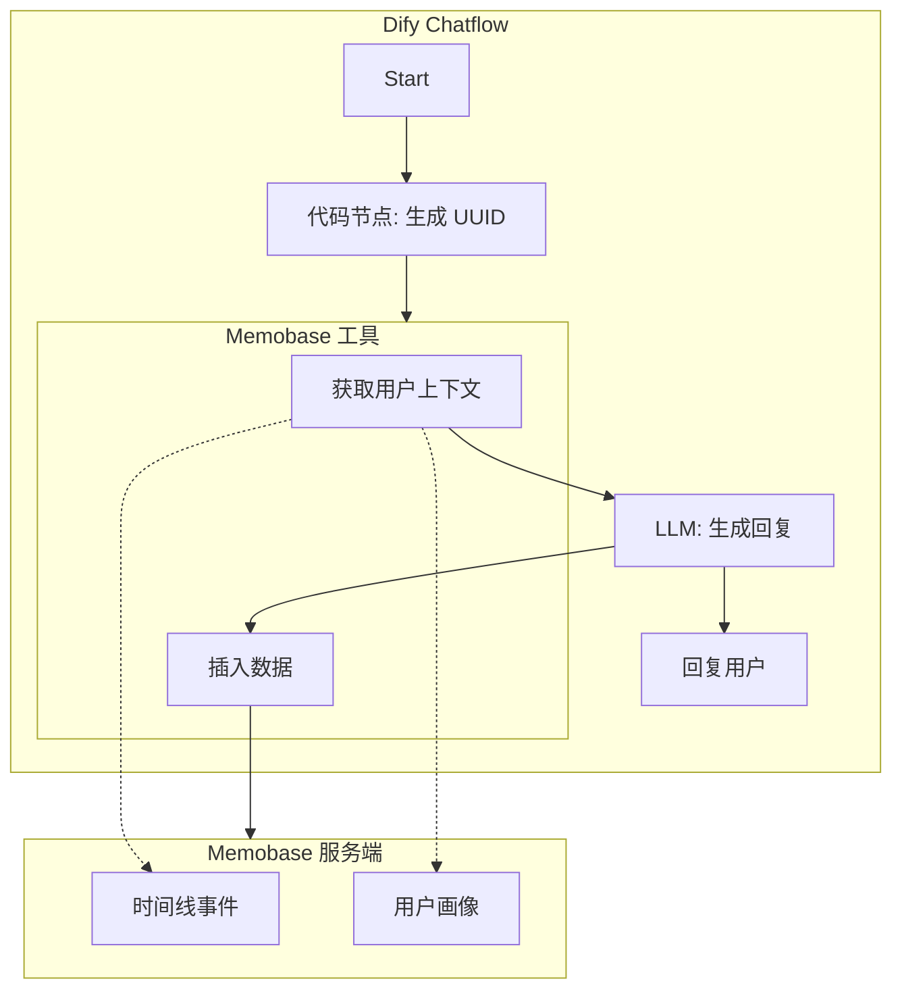

# Memobase 集成指南

本指南介绍了如何将 [Memobase](https://memobase.io) 集成到 Dify 中，为您的聊天机器人提供结构化的用户画像和长期记忆能力。

## 架构概览

集成采用"双写 (Dual-Write)"策略：Dify 负责 LLM 编排，Memobase 负责内存管理。



### 核心概念

1.  **Dify 作为编排者**：所有与 Memobase 的交互都发生在 Dify 工作流中，使用 Memobase 插件工具。
2.  **统一身份**：通过确定性 UUID v5 标识用户，基于平台 ID (如 `onebotv11:123456`) 生成，确保群聊和私聊中的身份一致性。
3.  **并行记忆体系**：
    *   **Memobase**：存储结构化画像（用户是谁？）和时间线事件（发生了什么？）。用户全局共享。
    *   **`personalizations.json`**：(遗留/补充) 存储 Bot 的有效行为规则和每群的独立配置。

---

## 安装设置

### 1. 安装 Dify 插件

1.  在 Dify 中，进入 **插件** -> **市场**。
2.  搜索 **Memobase** (`acane0320/memobase`)。
3.  安装插件。
4.  配置凭据：
    *   **Memobase URL**: 您的 Memobase 服务器地址 (例如 `http://localhost:8019`)。
    *   **API Key**: 您的 Memobase 项目 API Key。

### 2. Memobase 服务端

使用提供的 `config.yaml` 部署 Memobase：

```bash
# 复制已净化的配置文件
cp docs/memobase/config.yaml /path/to/memobase/src/server/api/config.yaml
```

请确保 `config.yaml` 中的字段与您的 Prompt 中使用的字段一致。提供的配置文件已针对聊天机器人场景进行了优化。

---

## 工作流集成

### 1. 用户 ID 生成 (代码节点)

所有工作流必须为 Memobase 生成一致的 UUID。请在工作流开始处的 **代码节点** 中使用以下 Python 代码。

**输入变量**: `user` (来自 `sys.user_id`)

```python
import re
import uuid

# 固定命名空间以保证一致性，如果希望群聊和私聊保持相同个人画像，可以使用相同的命名空间
# 示例 UUID，请务必替换为您自己的固定 UUID (可使用 uuid.uuid4() 生成)
NAMESPACE_GROUP = uuid.UUID('11111111-1111-1111-1111-111111111111')
NAMESPACE_PRIVATE = uuid.UUID('22222222-2222-2222-2222-222222222222')

def user_id_to_uuid(adapter: str, user_id: str, chat_type: str = "group") -> str:
    """根据平台用户 ID 生成确定性 UUID。"""
    combined_id = f"{adapter}:{user_id}"
    namespace = NAMESPACE_PRIVATE if chat_type == "private" else NAMESPACE_GROUP
    return str(uuid.uuid5(namespace, combined_id))

def main(user: str = "") -> dict:
    # 默认值
    adapter = "unknown"
    user_id = "unknown"
    chat_type = "group"
    
    if user:
        # 预期格式: adapter+type+id (例如 onebotv11+group+123456)
        parts = user.split('+')
        if len(parts) == 3:
            adapter = parts[0]
            middle = parts[1]
            user_id = parts[2]
            chat_type = "private" if middle == "private" else "group"
    
    memobase_id = user_id_to_uuid(adapter, user_id, chat_type)
    
    return {
        "memobase_user_id": memobase_id,
        "original_id": user_id,
        "adapter": adapter,
        "chat_type": chat_type
    }
```

### 2. 主聊天工作流

标准聊天流程会将记忆注入到用户消息上下文中。

1.  **代码节点**: 将 `sys.user` 转换为 UUID。
2.  **Memobase - 获取用户上下文 (Get User Context)**:
    *   `user_id`: `{{#code.memobase_user_id#}}`
3.  **模板节点 (Template)**: 合并记忆 + 查询。
    *   详见下文模板。
4.  **LLM 节点**: 生成回复。

#### 模板节点 (上下文注入)

组织 Memobase 上下文，最终在 LLM 节点中与原始的用户请求一起传给 LLM，以便 LLM 将其视为"关于用户的知识"。

```jinja2

[用户记忆档案]
{{ arg1[0].context }}

---

```
*   `arg1`: `{{#get_user_context.json#}}`

---

## 画像工作流 (批处理)

为了进行深度分析，您可以运行由 cron 任务触发的独立工作流来处理收集到的聊天记录。这允许进行更昂贵的推理，而不会拖慢实时聊天。

### 私聊画像工作流 (双分支)

对于私聊，对话是简单的 用户 <-> 助手 序列。详情参考 [私聊画像工作流](private-profiler.md)。

1.  **解析聊天记录**: 清理日志并格式化为 OpenAI 消息格式。
2.  **分支 A (记忆)**:
    *   **插入数据 (Insert Data)**: 将清理后的对话输入 Memobase。Memobase 的后台工作线程将提取画像。
3.  **分支 B (个性化)**:
    *   **LLM 分析**: 分析明确的用户指令（如"叫我主人"）或特定的 Bot 行为调整。
    *   **输出**: 生成 `personalizations.json` 所需的 JSON。

### 群聊画像工作流 (三分支)

群聊比较复杂，因为它包含 (1) 与 Bot 的直接互动 和 (2) Bot 观察到的用户对话。详情参考 [群聊画像工作流](group-profiler.md)。

1.  **解析消息**: 将日志拆分为"对话 (Conversations)"（用户与 Bot 对话）和"观察 (Observations)"（用户互相交谈）。
2.  **分支 A (对话)**:
    *   **插入数据 (Insert Data)**: `User Message: [Hi]`, `Assistant Message: [Hello]`.
3.  **分支 B (观察)**:
    *   **添加画像 (Add Profile)**: 直接写入。因为没有"助手回复"，无法使用标准的 `Insert Data` 流程。
    *   **LLM 分析**: 总结观察内容（例如，"用户正在讨论 Rust 编程"）。
    *   **工具调用**: `memobase_add_profile(topic="兴趣爱好", content="正在学习 Rust")`。
4.  **分支 C (群组元数据)**:
    *   **LLM 分析**: 分析整体群组氛围。
    *   **输出**: 生成 `group_profile` JSON。

---

## 最佳实践与隐私

*   **数据净化**: 确保传递给画像工作流的日志不包含不必要的个人身份信息 (PII)，除非画像需要。
*   **过滤**: "解析消息"代码节点应过滤掉系统消息（如"工具输出"、"搜索结果"），以便 Memobase 只看到类似人类的对话。
*   **成本管理**: 在 `config.yaml` 中配置 `buffer_flush_interval`，在更新速度和 LLM 成本之间取得平衡。
*   **一致性**: 始终使用相同的命名空间 UUID，以便如果用户从 群聊 A 切换到 私聊，他们的画像能够跟随（如果需要）。
